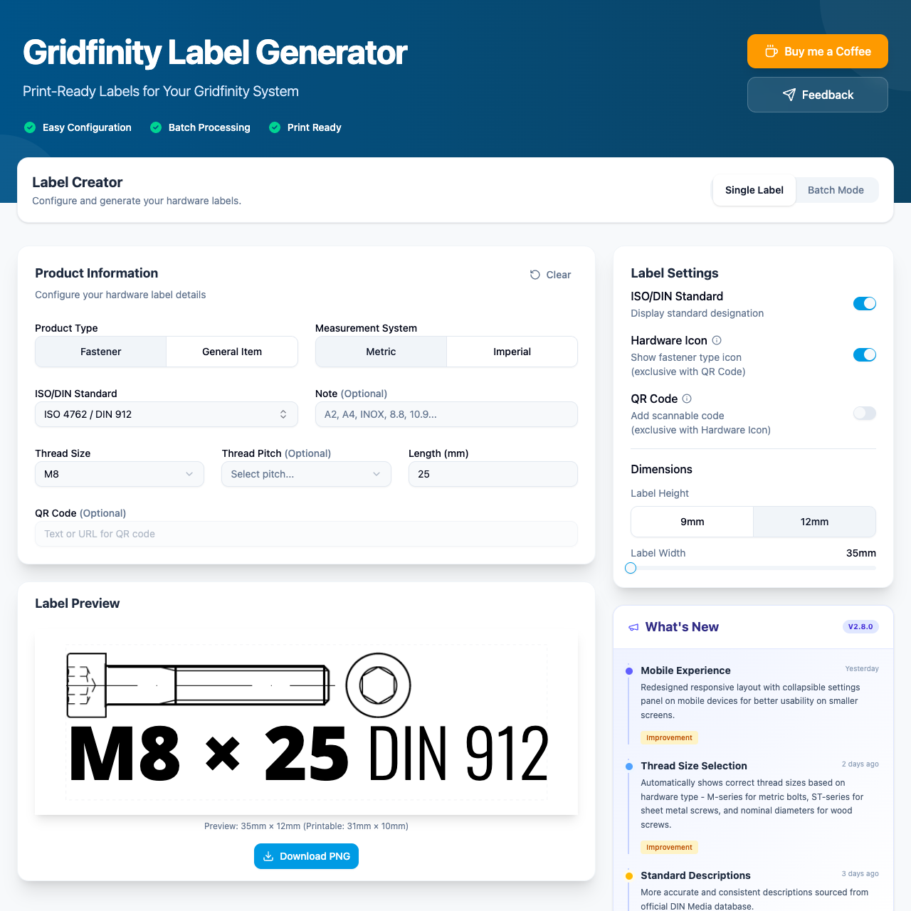

# Gridfinity Label Generator

[](https://gridfinitylabels.com)
[](https://github.com/kamilpajak/gridfinity-label-generator/actions/workflows/ci.yml)
[](https://sonarcloud.io/summary/overall?id=kamilpajak_gridfinity-label-generator)
[](https://sonarcloud.io/summary/overall?id=kamilpajak_gridfinity-label-generator)
[](https://github.com/kamilpajak/gridfinity-label-generator/tags)
[](LICENSE)
[](https://kit.svelte.dev/)
[](CONTRIBUTING.md)

Design and export print-ready labels for your [Gridfinity](https://gridfinity.xyz/) storage system. Built for makers who want tidy, consistent labels for fasteners (screws, nuts, washers, bolts) and any other small parts — right from the browser, no install required.

**[Try it now at gridfinitylabels.com](https://gridfinitylabels.com)**



## Features

- **Fastener Labels**: Generate labels for screws, bolts, nuts, and washers with automatic hardware type detection
- **General Item Labels**: Create custom labels for any storage need
- **Batch Mode**: Generate many labels at once, each with its own configuration
- **Custom Images**: Upload your own logos or product images (PNG, JPG, SVG with auto-compression)
- **Smart Thread Detection**: Shows the correct thread sizes based on the selected hardware type
- **Smart Formatting**: Formats thread sizes and lengths for metric or imperial units
- **Hardware Standards**: 200+ ISO/DIN standards with descriptions and cross-references
- **Real-time Preview**: See your label update as you design it
- **Export to PNG**: Download print-ready labels with descriptive filenames
- **QR Codes**: Optionally embed a QR code that links to more information
- **Mobile-Responsive**: Collapsible settings panel optimized for smaller screens
- **Display Options**: Toggle standard references, hardware images, and QR codes
- **Dimension Control**: Support for 9 mm and 12 mm label tape widths
- **What's New**: Built-in changelog with recent updates

## Tech Stack

- **Framework**: [SvelteKit](https://kit.svelte.dev/) with Svelte 5 (runes)
- **UI Components**: [shadcn-svelte](https://www.shadcn-svelte.com/) with [bits-ui](https://bits-ui.com/)
- **Styling**: [Tailwind CSS v4](https://tailwindcss.com/)
- **Icons**: [Lucide](https://lucide.dev/)
- **State**: Svelte stores (`svelte/store`)
- **Testing**: [Vitest](https://vitest.dev/) (unit) + [Playwright](https://playwright.dev/) (E2E)
- **Language**: TypeScript
- **Build Tool**: Vite
- **Runtime**: Node.js via `@sveltejs/adapter-node` (containerized with Docker)

## Quick Start

Requires [Node.js](https://nodejs.org/) 20+ and [pnpm](https://pnpm.io/).

```bash
# Clone the repository
git clone https://github.com/kamilpajak/gridfinity-label-generator.git
cd gridfinity-label-generator

# Install dependencies
pnpm install

# Start the development server
pnpm dev

# Open in your browser
open http://localhost:5173
```

## Development

```bash
pnpm dev          # Start development server with hot reload
pnpm build        # Build for production (adapter-node output)
pnpm preview      # Preview the production build locally
pnpm check        # Type-check with svelte-check
pnpm lint         # Check formatting (Prettier) and lint rules (ESLint)
pnpm format       # Auto-format the codebase with Prettier
```

The hardware standards data is generated from a small pipeline. See the "Standards Data" section of [CLAUDE.md](CLAUDE.md) and the `scripts/` directory for the `standards:*` commands.

## Testing

```bash
pnpm test         # Run all tests (unit + E2E)
pnpm test:unit    # Run Vitest unit tests (watch mode)
pnpm test:unit --run   # Run unit tests once
pnpm test:e2e     # Run Playwright E2E tests
```

- Unit tests use Vitest with separate browser and node environments.
- Browser component tests live in `*.svelte.test.ts` files; node tests in `*.test.ts` / `*.spec.ts`.
- End-to-end tests live in the `e2e/` directory.

## Deployment

The app builds to a standalone Node.js server via `@sveltejs/adapter-node` and ships as a container image.

```bash
# Build the production server
pnpm build

# Run it (output is written to the build/ directory)
node build
```

A container image is published to GitHub Container Registry:

```bash
docker run -p 3000:80 ghcr.io/kamilpajak/gridfinity-label-generator:latest
```

## Project Structure

```
gridfinity-label-generator/
├── src/
│   ├── routes/          # SvelteKit routes (pages + API endpoints)
│   ├── lib/
│   │   ├── components/  # UI components
│   │   ├── data/        # Generated hardware standards data
│   │   └── utils/       # Utility functions (with co-located *.test.ts)
│   ├── app.html         # HTML template
│   └── app.css          # Global styles (Tailwind)
├── e2e/                 # Playwright E2E tests
├── scripts/             # CLI tools (standards pipeline, image processing, release)
├── data/                # Standards config and metadata
├── docs/                # Documentation and assets
├── static/              # Static assets
└── package.json
```

## Contributing

Contributions are welcome — bug reports, feature ideas, and pull requests all help.

1. Fork the repository
2. Create a feature branch (`git checkout -b feature/your-feature`)
3. Make your changes and keep `pnpm lint`, `pnpm check`, and the tests green
4. Commit using [Conventional Commits](https://www.conventionalcommits.org/) (e.g. `feat: add tape width preset`)
5. Open a pull request

This project uses a **Contributor License Agreement (CLA)** / DCO sign-off so that the maintainer can keep offering the code under both the AGPL and a separate commercial license. You'll be asked to agree to it before your first pull request is merged. See [CONTRIBUTING.md](CONTRIBUTING.md) for the full guidelines and the CLA details.

## License

The original source code in this repository is licensed under the **GNU Affero General Public License v3.0 (AGPL-3.0-only)** — see the [LICENSE](LICENSE) file for the full text.

In short: if you run a modified version of this software as a network service, the AGPL requires you to make your modified source available to its users. If you cannot comply with the AGPL (for example, to embed or re-host this software without publishing your changes), a separate **commercial license is available** — contact the maintainer.

This license covers **only the project's own source code**. Third-party components (fonts, UI libraries, and other bundled materials) are subject to their own separate terms — see [Acknowledgments](#acknowledgments) below.

## Support

If you find this project helpful, consider:

- Starring the repository
- [Buying me a coffee](https://www.buymeacoffee.com/kamilpajak)
- [Reporting issues](https://github.com/kamilpajak/gridfinity-label-generator/issues)
- [Providing feedback](https://github.com/kamilpajak/gridfinity-label-generator/discussions)

## Acknowledgments

This project builds on the work of others:

- **Gridfinity** — the storage system by [Zack Freedman](https://www.youtube.com/watch?v=ra_9zU-mnl8). "Gridfinity" is used descriptively; this project is independent and not affiliated with or endorsed by its creator.
- **Fonts** — [Noto Sans](https://fonts.google.com/noto/specimen/Noto+Sans), [Oswald](https://fonts.google.com/specimen/Oswald), and [Fira Mono](https://fonts.google.com/specimen/Fira+Mono) (SIL Open Font License 1.1), delivered via [Fontsource](https://fontsource.org/).
- **Standards** — fastener standards are referenced by their designations (e.g. `DIN 912`, `ISO 4762`) for identification only. Standard numbers and titles remain the property of their respective standards bodies (DIN, ISO); obtain official standards from their publishers.
- **Open-source tooling** — the [SvelteKit](https://kit.svelte.dev/) team, [shadcn-svelte](https://www.shadcn-svelte.com/), [Tailwind CSS](https://tailwindcss.com/), [Lucide](https://lucide.dev/), and the wider ecosystem this app is built on.

Full attribution and third-party license notices are collected in [THIRD-PARTY-NOTICES.md](THIRD-PARTY-NOTICES.md).
