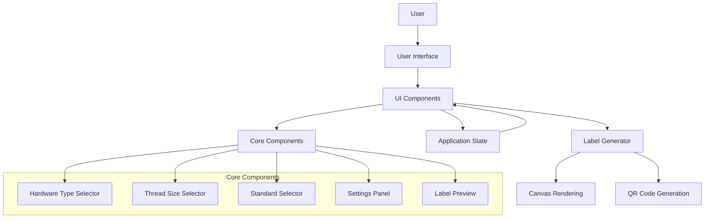
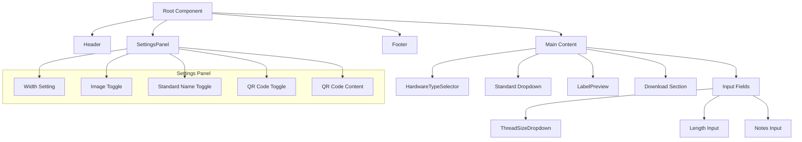
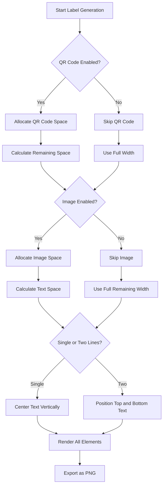
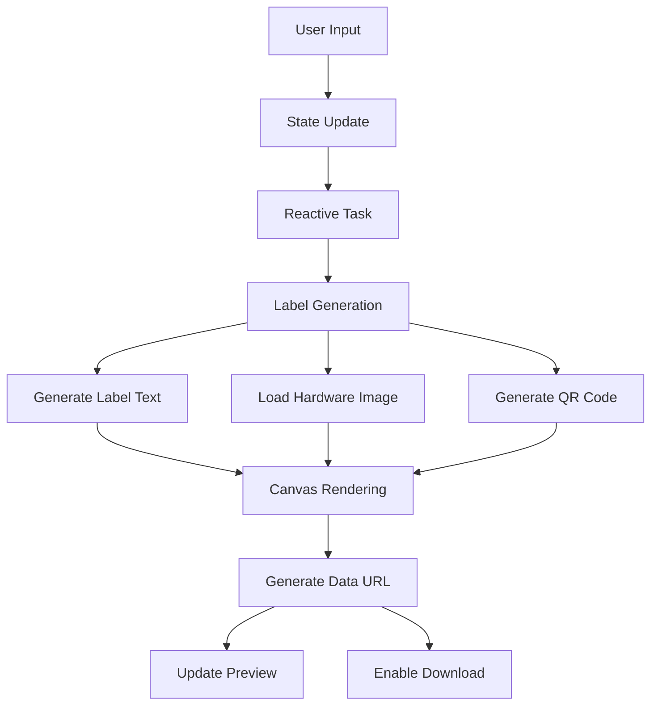

# System Patterns: Gridfinity Label Generator

## Architecture Overview

The Gridfinity Label Generator follows a component-based architecture using Qwik City as its foundation. The application is structured to optimize for performance, maintainability, and a clear separation of concerns.

## Key Design Patterns

### 1. Component-Based Architecture
- **Implementation**: The application is divided into focused, reusable components
- **Benefits**: Improved maintainability, code reuse, and separation of concerns
- **Examples**: HardwareTypeSelector, ThreadSizeDropdown, SearchableDropdown, LabelPreview

### 2. Reactive State Management
- **Implementation**: Qwik's reactive primitives (useSignal, useStore, useTask$)
- **Benefits**: Automatic UI updates when state changes, optimized rendering
- **Examples**: 
  - Signals for simple values (selectedType, threadSize)
  - Stores for complex objects (settings)
  - Tasks for reactive computations (useTask$ for label generation)

### 3. Unidirectional Data Flow
- **Implementation**: State flows down from parent to child components
- **Benefits**: Predictable state changes, easier debugging
- **Examples**: Settings passed from main component to SettingsPanel

### 4. Event Handler Pattern
- **Implementation**: Handler functions with $ suffix for Qwik's optimization
- **Benefits**: Optimized event handling with automatic lazy-loading
- **Examples**: handleTypeChange$, handleSystemChange$, handleSettingsChange$

### 5. Lazy Loading
- **Implementation**: Qwik's built-in lazy loading capabilities
- **Benefits**: Improved initial load performance, reduced bundle size
- **Examples**: Components and handlers only load when needed

## Component Relationships

## Label Generation System

The label generation system is a core part of the application with a sophisticated approach to layout and rendering.

### Priority-Based Layout System

### Label Element Positioning Logic

1. **QR Code (Highest Priority)**
   - Fixed size: 10mm x 10mm
   - Position: Right side of label
   - When enabled, reduces available width for other elements

2. **Image Positioning**
   - Position: Left side of available space
   - Scaling: Preserves aspect ratio
   - Maximum width: 40% of available width (after QR code allocation)
   - Gap: Added between image and text

3. **Text Positioning**
   - Position: Center of remaining space (horizontally)
   - Single-line mode: Vertically centered
   - Two-line mode: 
     - Top text aligned to top edge
     - Bottom text aligned to bottom edge

4. **Text Scaling**
   - Dynamic font size calculation based on available width
   - Different font families for top text (Noto Sans) and bottom text (Oswald)
   - Scaling algorithm ensures text fits within allocated space

### Measurement System

The application uses a sophisticated measurement system to ensure accurate physical dimensions:

1. **Unit Conversion**
   - Conversion between millimeters (mm) and pixels
   - Dynamic calculation based on device pixel density
   - Ensures consistent physical size regardless of display

2. **Canvas Rendering**
   - HTML Canvas API for precise pixel-level control
   - Text measurement to calculate exact dimensions
   - Font loading and verification to ensure consistent rendering

3. **Responsive Scaling**
   - Label width adjustable by user (in mm)
   - Fixed height (10mm) for consistency
   - All internal measurements scale proportionally

## Data Flow

## Error Handling

1. **Font Loading**
   - Multiple fallback mechanisms for font loading
   - Verification of font availability before rendering
   - Graceful degradation if fonts fail to load

2. **Image Loading**
   - Fallback from SVG to JPG if primary format fails
   - Null checks to handle missing images
   - Appropriate error logging

3. **User Input Validation**
   - Required field validation
   - Appropriate UI feedback for missing information
   - Disabled download button until all required fields are filled
